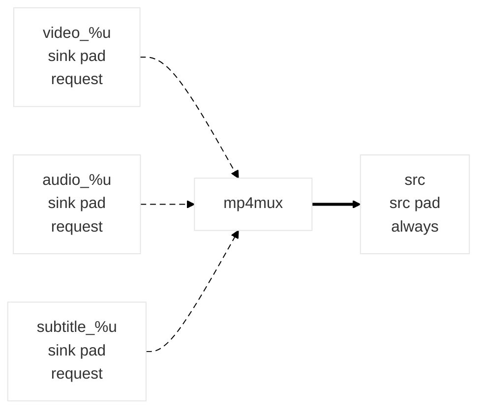
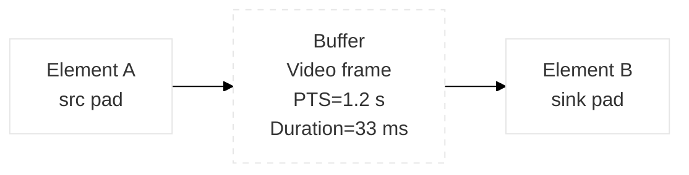
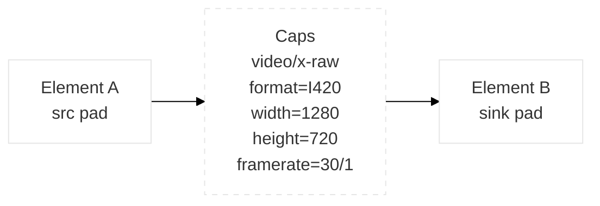

# Install GStreamer (Debian/Ubuntu)

```bash
sudo apt-get update -y
sudo apt install -y \
  gstreamer1.0-plugins-base \
  gstreamer1.0-plugins-good \
  gstreamer1.0-plugins-bad \
  gstreamer1.0-plugins-ugly \
  gstreamer1.0-opencv \
  gstreamer1.0-libav \
  gstreamer1.0-tools \
  gstreamer1.0-plugins-rtp \
  gstreamer1.0-rtsp
```
# Verify version

```bash
gst-launch-1.0 --version
```

# Tools

## gst-launch

```bash
gst-launch-1.0 videotestsrc ! autovideosink
```

## gst-inspect

 ```bash
gst-inspect-1.0
# Search enc elements
gst-inspect-1.0 | grep enc
# Inspect one element in depth
gst-inspect-1.0 videotestsrc
```  
# Concepts

## Pads



### Notes

- `video_%u`, `audio_%u`, and `subtitle_%u` are request sink pad templates.
- `src` is the always-available source pad.

```bash
gst-inspect-1.0 mp4mux
``` 

## Buffers



```bash
gst-launch-1.0 videotestsrc num-buffers=5 ! identity silent=false dump=false ! fakesink -v
``` 
## Caps


```bash
gst-launch-1.0 -v videotestsrc ! video/x-raw,format=I420,width=1280,height=720 ! fakesink
```

## Push vs Pull models

### Push mode
```bash
gst-launch-1.0 -v \
videotestsrc num-buffers =10 ! \
identity silent=false ! \
videoconvert ! \
x264enc bitrate =2048 ! \
mp4mux ! \
filesink location = input.mp4 
```
### Pull mode
```bash
gst-launch-1.0 -v \
filesrc location = input.mp4 ! \
identity silent=false ! \
qtdemux ! \
h264parse ! \
avdec_h264 ! \
fakesink
```
